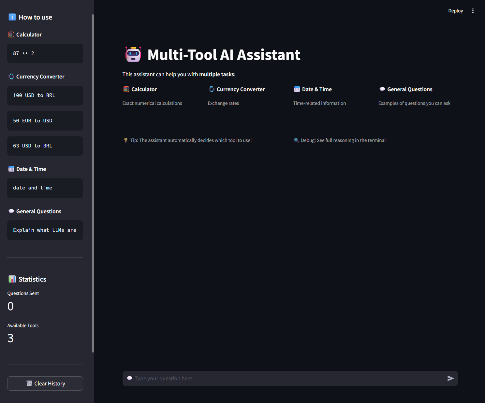

<h1 align="center"> 🤖 Multi-Tool AI Assistant </h1>

<p align="center">
   
</p>

## Objective
This project demonstrates how to integrate a language model (LLM) with decision logic to:

- decide when to answer directly using the model's knowledge;
- decide when to call external tools to obtain exact answers (at minimum, a Calculator);
- structure the code clearly and provide documentation so reviewers can follow your design.

## Project structure
- `app.py` — Streamlit web UI.
- `agent.py` — Agent creation, tool-detection logic and question processing.
- `tools.py` — Implementations of tools: `Calculator`, `CurrencyConverter`, `DateTime`.
- `prompt.py` — ReAct-style prompt template used by the agent.
- `config.py` — Environment loading and LLM client creation (AzureChatOpenAI).
- `requirements.txt` — Project dependencies.
- `tests.py` — Test script for tools and agent (run with `python tests.py`).

## Implementation notes
- The agent uses a ReAct prompt format (Question / Thought / Action / Observation / Final Answer).
- Before invoking the LLM, `agent.py` runs `identify_tool()` to detect whether the input should be routed to a tool (calculator, currency conversion, date/time). If a tool is identified, the code calls the tool function directly and returns a structured response.
- If no tool is selected, the agent invokes the LLM. The AgentExecutor can call tools itself when the model decides to (ReAct behavior).

### Calculator safety
- The `calculator` tool avoids `eval`. It normalizes many natural phrases (e.g., "128 times 46", "2 to the power of 8") into a Python expression and evaluates it using AST parsing with a whitelist of allowed operators. This prevents arbitrary code execution.

- ## Test results (executed with `python tests.py`)
All tool tests ran locally; the agent was also exercised. Summary of the run you provided:

- Calculator:
  - `2 + 2` -> Result: 4 ✅
  - `128 * 46` -> Result: 5888 ✅
  - `100 / 5` -> Result: 20.0 ✅
  - `2 ** 10` -> Result: 1024 ✅
  - `(10 + 5) * 3` -> Result: 45 ✅
  - `sqrt of 144` -> Result: 144 ❌ (note: `sqrt` was not normalized to `**0.5` — can be added)
  - Division by zero and invalid input produced proper error messages ✅

- CurrencyConverter:
  - `100 USD to BRL` -> `100.00 USD = 533.00 BRL` ✅
  - `50 EUR to USD` -> `50.00 EUR = 58.14 USD` ✅

- DateTime:
  - `date` -> `Date: 27/11/2025` ✅
  - `time` -> `Time: 19:32:50` ✅

- Agent:
  - `What is 128 times 46?` was routed to the calculator and returned `Result: 5888` ✅
  - `Who was Albert Einstein?` invoked the LLM and returned a coherent multi-sentence answer (success=True) ✅

Notes from the agent run:
- The LangChain AgentExecutor printed a parsing warning in the terminal: `Invalid Format: Missing 'Action:' after 'Thought:'`. This indicates the model's raw output didn't strictly follow the ReAct template in one instance. Despite that, the model produced a valid Final Answer and the agent returned the response. You can tighten the prompt or add output post-processing to avoid these warnings.

## What I would improve (next steps)
1. Add normalization for `sqrt` / `square root` and other math functions.
2. Convert `tests.py` to `pytest` style with assertions and add CI (GitHub Actions).
3. Optionally force a machine-readable output format from the LLM (JSON) to avoid ReAct parsing fragility.
4. Add a `requirements-dev.in` with testing and linting tools and generate pinned dev requirements.

## How to run (step-by-step)
1. Create a virtual environment (recommended):
```powershell
python -m venv venv
venv\Scripts\Activate.ps1
```
2. Install dependencies:
```powershell
pip install -r requirements.txt
```
3. Configure environment variables:
Create a `.env` file in the project root with:
```
API_BASE=https://your-azure-endpoint
API_KEY=YOUR_API_KEY
AZURE_DEPLOYMENT=gpt-4o
AZURE_API_VERSION=2024-06-01
```
4. Run the web UI:
```powershell
streamlit run app.py
```

Open `http://localhost:8501` in your browser.


